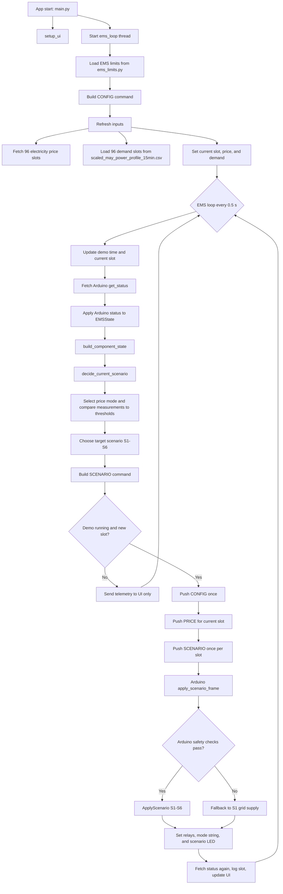
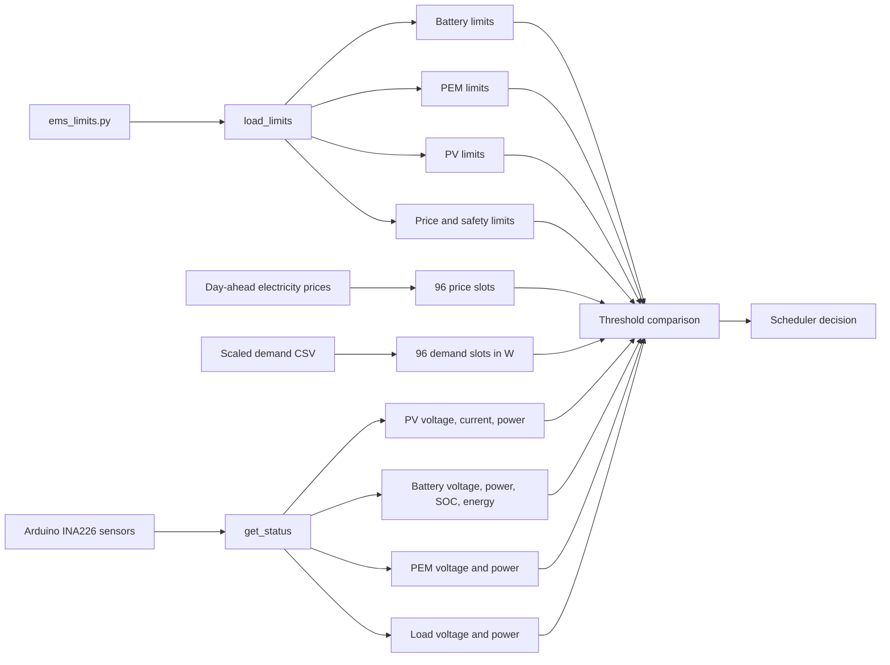
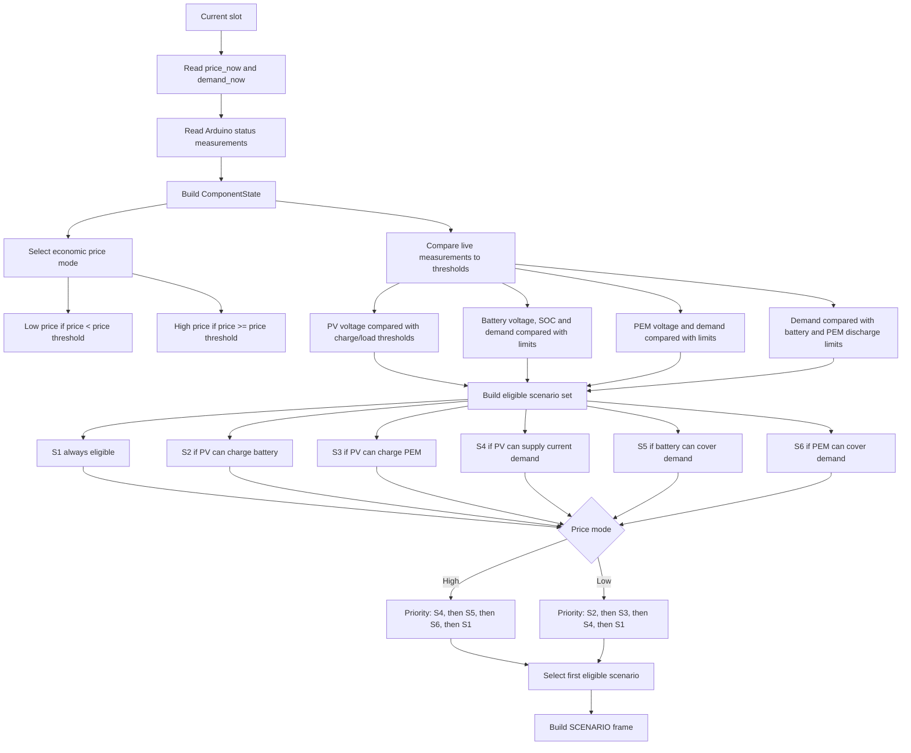
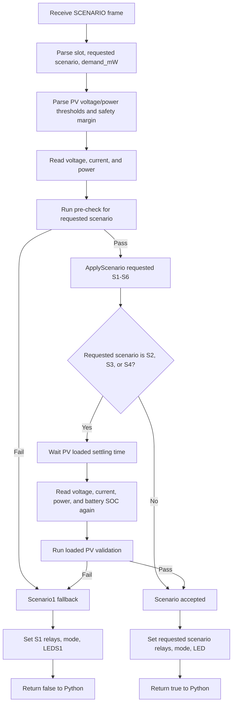
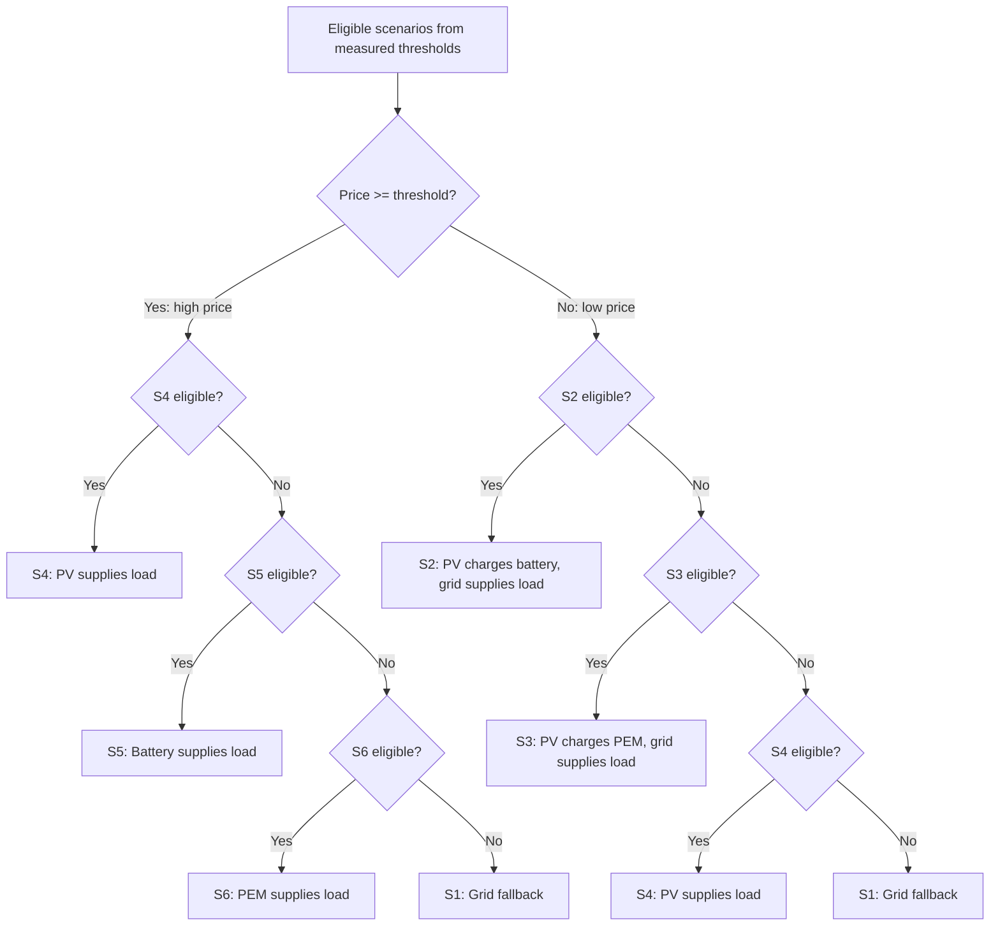

# EMS Flowchart From Inputs to Scenario Initiation

This document maps the EMS control path from input parameters and live data to
scenario initiation for scenarios S1-S6.

Main source files:

- `app/python/main.py` starts the app and the EMS background loop.
- `app/python/ems_loop.py` refreshes input data, calls the scheduler, sends
  commands to Arduino, logs results, and updates the UI.
- `app/python/ems/ems_limits.py` contains editable price, PV, battery, PEM,
  load, and safety limits.
- `app/python/scheduler.py` reads price, demand, and Arduino measurements,
  evaluates threshold eligibility, chooses the target scenario, and builds the
  `SCENARIO` command.
- `app/python/ems_state.py` stores current values and converts Arduino status
  into the scheduler's component state.
- `app/python/bridge.py` sends `CONFIG`, `PRICE`, and `SCENARIO` frames to the
  Arduino sketch.
- `app/sketch/sketch.ino` reads sensors, performs final safety checks, switches
  relays, sets LEDs, and reports status.

## 1. Overall Data Flow



## 2. Input Parameters And Live Measurements



## 3. Scheduler Scenario Selection

In the simplified EMS interpretation, the components are not placed in
operating modes. Only the price creates an economic mode from one threshold:
prices below `PRICE_LIMITS.high_price_min_DKK_per_kWh` are low-price mode, and
prices at or above it are high-price mode. The physical components are measured
and compared directly with their safety and operating thresholds.



## 4. Arduino Scenario Validation And Initiation



## 5. Scenario Conditions And Actions

| Scenario | Scenario behavior | Scheduler eligibility | Arduino pre-check | Arduino loaded validation | Initiation action |
| --- | --- | --- | --- | --- | --- |
| S1 | Grid supplies load. PV, battery and PEM isolated. | Always eligible. | Always accepted. | None. | `Scenario1()` sets grid-load relay state and `LEDS1`. |
| S2 | Grid supplies load. PV charges battery. | PV voltage reaches battery-charge threshold and battery SOC is below full. | PV voltage high enough, battery voltage below max, battery SOC below full. | PV current positive, PV power above battery-charge threshold, battery still below max/full. | `Scenario2()` connects PV to battery and keeps grid supplying load. |
| S3 | Grid supplies load. PV charges PEM. | PV is available and PEM can accept charge. | PV voltage high enough for PEM charging. | PV current positive and PV power above PEM-charge threshold. | `Scenario3()` connects PV to PEM and keeps grid supplying load. |
| S4 | PV supplies load. | PV voltage reaches load-supply threshold. | PV voltage high enough for load supply. | PV current positive, PV power above load-supply threshold, and PV power covers demand plus safety margin. | `Scenario4()` connects PV to load. |
| S5 | Battery supplies load. | Battery voltage above minimum, optional SOC above low limit, and demand within battery load limit. | Battery voltage above minimum, SOC above low SOC threshold, and demand within battery discharge limit plus safety margin. | None. | `Scenario5()` connects battery to load. |
| S6 | PEM supplies load. | PEM voltage above minimum and demand within PEM load limit. | PEM voltage above minimum and demand within PEM discharge limit. | None. | `Scenario6()` connects PEM to load. |

## 6. Scenario Priority Summary



## 7. Command Frames Sent To Arduino

```text
CONFIG,<bat_min_V>,<bat_full_V>,<bat_empty_test_V>,<bat_full_test_V>,
<bat_capacity_mWh>,<bat_low_soc>,<bat_full_soc>,<bat_max_discharge_mW>,
<pem_min_V>,<pem_max_discharge_mW>,<safety_mW>
```

```text
PRICE,<electricity_price_dkk_kWh>,<slot>
```

```text
SCENARIO,<slot>,<scenario>,<demand_mW>,
<pv_battery_charge_min_V>,<pv_battery_charge_min_mW>,
<pv_pem_charge_min_V>,<pv_pem_charge_min_mW>,
<pv_load_supply_min_V>,<pv_load_supply_min_mW>,
<safety_mW>
```

## 8. Relay And LED Outputs

| Scenario | K1 | K2 | K3 | K4 | K5 | K6 | K7 | LED |
| --- | --- | --- | --- | --- | --- | --- | --- | --- |
| S1 | HIGH | LOW | HIGH | HIGH | HIGH | HIGH | HIGH | LEDS1 |
| S2 | HIGH | LOW | LOW | HIGH | HIGH | HIGH | LOW | LEDS2 |
| S3 | HIGH | LOW | HIGH | LOW | HIGH | HIGH | LOW | LEDS3 |
| S4 | LOW | HIGH | HIGH | HIGH | HIGH | HIGH | LOW | LEDS4 |
| S5 | LOW | LOW | HIGH | HIGH | LOW | HIGH | HIGH | LEDS5 |
| S6 | LOW | LOW | HIGH | HIGH | HIGH | LOW | HIGH | LEDS6 |
